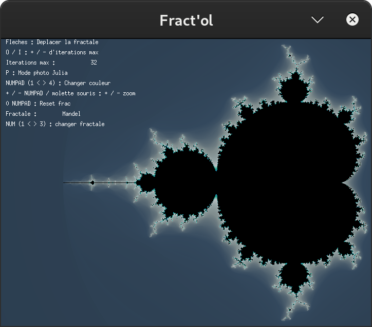
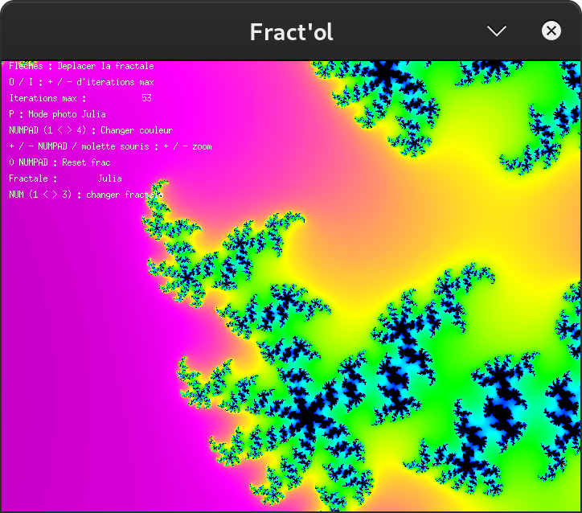
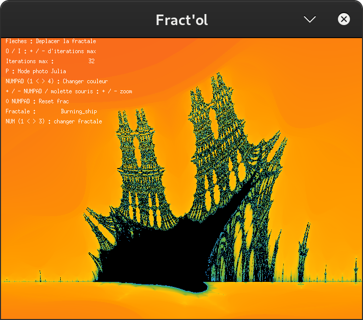

# Fractol Project

## Introduction

This repository contains the Fractol project, a 42 school assignment focused on exploring fractal mathematics and interactive graphics programming. Fractol offers a deep dive into the beauty of fractals, allowing users to visualize different types of fractals in real-time, with interactive controls to zoom, change colors, and explore the intricate details of each fractal pattern.

## Features

- Real-time fractal rendering
- Support for multiple fractal types (Mandelbrot, Julia, and more)
- Interactive zoom and navigation
- Dynamic color schemes
- Adjustable iteration limits for detailed exploration

## Dependencies

Fractol is built using the MinilibX library, specific to 42 school's ecosystem, and requires the following to run:

- GCC or Clang compiler
- Make
- MinilibX (provided by 42 school)
- A Linux or MacOS system

## Installation

To compile Fractol, follow these steps:

1. Clone the repository to your local machine:

```bash
git clone git@github.com:akhellad/fractol.git
```
2. Navigate to the cloned directory:

```bash
cd fractol
```

3. Compile the project:

```bash
make
```

## Usage

To run Fractol, after compiling, use:

```bash
./fractol [fractal type]
```

Replace `[fractal type]` with the name of the fractal you wish to view (e.g., `Mandelbrot`, `Julia`). Use the interactive controls to zoom, navigate, and change the appearance of the fractal.

## Screenshots

Below are some screenshots showcasing the fractals you can explore with this project. You will need to replace the placeholder URLs with the actual URLs to your images.





## Credits

This project was developed by Ahmed Khelladi, a student at Ecole 42. Special thanks to the 42 school for providing the curriculum and resources that made this project possible.


